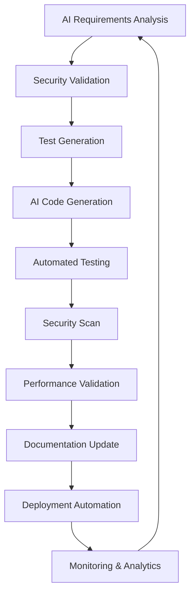

## 🤖 AI Development Guide - AI COPILOT ENTRY POINT

**🚨 CRITICAL: Read This Before Any Development Work**  
**Version:** 3.0  
**Last Updated:** October 25, 2025  
**Status:** ✅ PRODUCTION READY - MANDATORY READING

---

## 🎯 DEVELOPER EXPECTATIONS - AI COPILOT ONBOARDING

### **⚡ EFFICIENCY FIRST - DON'T WASTE TIME**
```bash
# WRONG: Individual operations
git add file1.js
git commit -m "fix1"
git add file2.js  
git commit -m "fix2"

# RIGHT: Batch operations
git add . && node scripts/unified/smart-commit.js
# Multiple changes in one efficient commit
```

### **🛠️ USE EXISTING SCRIPTS - LEARN THE CODEBASE**
```bash
# MANDATORY: Survey existing tools before coding
find scripts/ -name "*.js" | head -20    # See what exists
ls scripts/unified/                      # Core tools (USE THESE)
ls scripts/organized/                    # Specialized tools (LEARN THESE)
```

### **🔧 FIX BROKEN SCRIPTS - DON'T WORK AROUND**
```bash
# WRONG: Skip broken script, create workaround
echo "Script is broken, I'll do it manually..."

# RIGHT: Fix the broken script
node scripts/unified/test-runner.js health  # If this fails...
# 1. Identify the error
# 2. Fix the root cause  
# 3. Test the fix
# 4. Document the solution
```

## 🎯 Core AI Development Principles

### **🧪 Test-Driven AI Development (TDAID) - MANDATORY**
All AI-assisted code development must follow **Test-First** methodology:

```bash
# REQUIRED AI development workflow - NO EXCEPTIONS
1. BUILD/ENHANCE THE TEST FIRST (Red Phase)
2. RUN THE TEST (should fail initially - proves test validity)  
3. AI generates/fixes the code (Green Phase)
4. RUN THE TEST (should pass - proves implementation works)
5. REFACTOR with AI assistance (Clean Phase)
6. VALIDATE with comprehensive test suite (90%+ coverage required)
```

### **📚 Documentation & Script Maintenance - REQUIRED**
Before any development work:
- 📖 **Check existing documentation** in `/documentation/` structure first
- 🔍 **Use existing unified scripts** from `/scripts/unified/`:
  - `aws-manager.js` for all AWS operations
  - `test-runner.js` for all testing needs  
  - `deployment-manager.js` for all deployment tasks
- 📝 **Update documentation** with every code change
- 🔗 **Provide direct file paths** - no vague references requiring searches

### **💾 Commit & Process Standards - ENFORCED**
Every code change must follow:
- 🔒 **Use smart-commit.js ONLY** - `/scripts/unified/smart-commit.js`
- 🛡️ **Security validation required** before any production commit
- 🏗️ **Process isolation mandatory** - separate concerns into testable units
- 📋 **Context document updates** when saving state for context compaction

### **✅ Proof & Validation Requirements - NO EXCEPTIONS**
When claiming completion, ALWAYS provide:
- 🧪 **Test results with output** - show actual test execution results
- 📊 **Performance metrics** for any optimization claims
- 📁 **Direct file links** with full paths: `/path/to/specific/file.js`
- 📈 **Before/after comparisons** for improvement claims
- 🔄 **Validation commands** that others can run to verify claims

### **Security-First AI Coding**
Every AI-generated code change requires:
- ✅ **Credential Detection:** Automated scanning for exposed authentication data
- ✅ **API Hardening:** No bypassing established APIs or security layers
- ✅ **Input Validation:** Comprehensive validation for all inputs
- ✅ **Runtime Logging:** Enhanced logging for debugging and monitoring

### **🔒 Privacy & Boundaries - STRICT**
- 🚫 **NEVER modify `.current-notes.md`** - private developer workspace
- 🔒 **Respect private files** and personal organization systems
- 📝 **Use designated context areas** for AI collaboration only

### **Quality Validation Standards**
- ✅ **Full Regression Suite:** Run complete validation, not individual tests
- ✅ **Live Output Monitoring:** Scan console output for errors during execution
- ✅ **Process Isolation:** Use background processes with proper monitoring
- ✅ **Code Reusability:** Leverage existing helper functions, avoid reinventing

---

## 🛡️ Enhanced Security Patterns for AI Development

### **Automated Security Validation**
```bash
# Security-first AI development workflow
./wl-git commit     # Includes automatic security scanning
./wl-test security  # Comprehensive security validation
./wl-run isolated   # Process isolation with monitoring
```

### **Sensitive Data Detection Framework**
All AI-generated code is automatically scanned for:
- 🔐 **API Credentials:** Stripe, AWS, Google, GitHub authentication
- 🔑 **Access Controls:** Authentication headers, webhook URLs  
- 📄 **Configuration:** Environment variables, database connection strings
- 🛡️ **Critical Files:** Protection against accidental deletion

### **API Security Hardening**
```javascript
// AI-generated code must follow security patterns
app.post('/api/endpoint', [
    // Required middleware stack
    validateInput,           // Input sanitization
    authenticateUser,        // User authentication  
    authorizeAction,         // Permission validation
    rateLimit(),            // Rate limiting
    auditLog,               // Security audit logging
], async (req, res) => {
    // AI-generated secure implementation
});
```

---

## 🧪 Comprehensive Testing Framework for AI Code

### **Multi-Layered Testing Strategy**
```
Testing Pyramid for AI Development:
       🔺 E2E Tests (AI-generated scenarios)
      ────────────────────────────────────
     🔶 Integration Tests (API validation)
    ──────────────────────────────────────  
   🟦 Unit Tests (AI-enhanced coverage)
  ────────────────────────────────────────
```

### **AI-Enhanced Test Generation**
```javascript
// AI-powered test generation pattern
class AITestGenerator {
    generateTests(codeFunction) {
        return [
            this.generateUnitTests(codeFunction),
            this.generateEdgeCases(codeFunction),
            this.generateSecurityTests(codeFunction),
            this.generatePerformanceTests(codeFunction)
        ];
    }
}
```

### **Validation Requirements Checklist**
Before any AI-generated code deployment:
- [ ] **Sensitive Data Exposed?** Automated credential detection passed
- [ ] **API Bypassing?** No direct database/service access bypassing APIs
- [ ] **Sufficient Validation?** Input validation and error handling implemented
- [ ] **Runtime Logging?** Enhanced logging and monitoring configured  
- [ ] **Refactoring Needed?** Code quality and maintainability reviewed
- [ ] **Helper Reuse?** Existing utilities leveraged, no wheel reinvention
- [ ] **Idempotency?** Script can run multiple times without failure

---

## 🔄 Multi-Copilot Collaboration Framework

### **Context-Aware AI Development**
The AI development system supports **5 specialized contexts** for parallel development:

#### **🔐 Security Context - AI Security Specialist**
**Responsibilities:**
- Automated security scanning and validation
- Critical file protection and access control
- Security pattern enforcement and compliance monitoring
- Real-time threat detection and incident response

**Tools & Integration:**
```bash
# Security-focused AI development
./wl-git commit --security-scan
./wl-test security --comprehensive
./security-audit.js --ai-powered
```

#### **🧪 Testing Context - AI Testing Specialist**  
**Responsibilities:**
- Intelligent test generation and optimization
- Comprehensive coverage analysis and reporting  
- AI-powered failure analysis and debugging
- Performance and load testing automation

**Tools & Integration:**
```bash
# AI-enhanced testing workflows
./wl-test generate --ai-powered
./wl-test analyze --intelligent-debugging
./wl-test optimize --coverage-enhancement
```

#### **☁️ DevOps Context - AI Infrastructure Specialist**
**Responsibilities:**
- Intelligent AWS resource optimization
- Automated CI/CD pipeline management
- Infrastructure monitoring and scaling
- Deployment automation and rollback procedures

**Tools & Integration:**
```bash
# AI-powered infrastructure management
./wl-aws optimize --intelligent-scaling
./wl-aws deploy --automated-validation
./wl-aws monitor --predictive-alerts
```

#### **📚 Documentation Context - AI Documentation Specialist**
**Responsibilities:**  
- Automated documentation generation and maintenance
- Code-to-documentation synchronization
- Intelligent cross-referencing and search
- Multi-language documentation support

**Tools & Integration:**
```bash
# AI documentation automation
./wl-docs generate --code-sync
./wl-docs validate --accuracy-check
./wl-docs optimize --search-enhancement
```

#### **⭐ Features Context - AI Development Specialist**
**Responsibilities:**
- AI-assisted feature development and optimization
- User experience enhancement and analytics
- Performance optimization and monitoring
- Modern UI/UX development patterns

**Tools & Integration:**
```bash
# AI-enhanced feature development
./wl-run development --ai-assisted
./wl-test features --comprehensive
./feature-analytics --ai-insights
```

---

## ⚡ Enhanced Development Workflow Patterns

### **AI-Powered Development Cycle**


### **Intelligent Process Management**
```bash
# Enhanced development workflow with AI
./wl-run development --ai-assisted --background --monitored
./wl-test comprehensive --parallel --coverage-tracking
./wl-git commit --ai-validation --security-scan --automated-docs
./wl-aws deploy --intelligent-staging --performance-validation
```

### **Real-Time Monitoring & Debugging**
- ✅ **Live Console Output:** Real-time error detection and analysis
- ✅ **Background Process Management:** Proper daemon management with monitoring
- ✅ **Automated Log Analysis:** AI-powered log parsing and issue identification  
- ✅ **Performance Profiling:** Continuous performance monitoring and optimization

---

## 🚀 Advanced AI Development Tools Integration

### **Enhanced Git Workflows with AI**
```bash
# Intelligent commit workflow
./wl-git commit "feat: AI-powered feature enhancement"
# Automatically includes:
# - Security scanning for exposed secrets
# - Critical file protection validation
# - Test execution and validation
# - Documentation updates
# - Performance impact analysis
```

### **AI-Powered Testing Automation**
```bash
# Comprehensive AI testing suite  
./wl-test full --ai-enhanced
# Includes:
# - Intelligent test generation
# - AI-powered failure analysis
# - Performance regression testing
# - Security vulnerability scanning
# - Coverage optimization suggestions
```

### **Intelligent Infrastructure Management**
```bash
# AI-optimized AWS operations
./wl-aws optimize --cost-analysis --performance-tuning
./wl-aws monitor --predictive-scaling --anomaly-detection
./wl-aws deploy --intelligent-validation --automated-rollback
```

---

## 🔍 Quality Assurance & Validation Framework

### **Pre-Deployment Validation Checklist**
All AI-generated code must pass comprehensive validation:

#### **Security Validation** ✅
- [ ] Secret detection scan completed and passed
- [ ] API security patterns enforced
- [ ] Input validation implemented
- [ ] Authentication and authorization verified
- [ ] Rate limiting and abuse prevention configured

#### **Code Quality Validation** ✅  
- [ ] Test coverage > 90% achieved
- [ ] Performance benchmarks met
- [ ] Code style and standards compliance
- [ ] Documentation generated and validated
- [ ] Helper function reuse optimized

#### **Operational Validation** ✅
- [ ] Background processes properly configured
- [ ] Logging and monitoring enhanced
- [ ] Error handling comprehensive
- [ ] Rollback procedures tested
- [ ] Idempotency validated (can run multiple times)

---

## 🎯 Performance Optimization Patterns

### **AI-Enhanced Performance Monitoring**
```javascript
// Performance monitoring integration
const performanceMonitor = new AIPerformanceMonitor({
    realTimeTracking: true,
    aiOptimization: true,
    predictiveScaling: true,
    bottleneckDetection: true
});

// Automated performance optimization
await performanceMonitor.optimizeApplication();
await performanceMonitor.predictPerformanceIssues();
```

### **Intelligent Caching & Optimization**
- ✅ **Smart Caching:** AI-powered cache optimization strategies
- ✅ **Database Optimization:** Intelligent query optimization and indexing
- ✅ **CDN Enhancement:** AI-driven content delivery optimization
- ✅ **Resource Management:** Predictive resource allocation and scaling

---

## 📊 Metrics & Analytics for AI Development

### **Development Velocity Metrics**
- 📈 **Code Generation Speed:** AI-assisted development efficiency
- 🧪 **Test Coverage:** Automated test generation and validation
- 🔐 **Security Compliance:** Real-time security validation success rate
- 🚀 **Deployment Frequency:** Automated deployment success rate
- 📚 **Documentation Accuracy:** Code-to-documentation synchronization

### **Quality Metrics Dashboard**
```bash
# AI development metrics dashboard
./metrics-dashboard --ai-development
# Displays:
# - Security scan success rate
# - Test coverage trends  
# - Performance optimization impact
# - Documentation accuracy score
# - Multi-Copilot collaboration efficiency
```

---

## 🔧 Troubleshooting & Best Practices

### **Common AI Development Issues & Solutions**

#### **Issue: Background Process Management**
**Problem:** Node.js processes running in foreground, killed by subsequent commands
**Solution:** 
```bash
# Proper background process management
./wl-run server --background --monitored
./wl-test watch --daemon --log-output
```

#### **Issue: Hidden Logs and Output**
**Problem:** Cannot see server logs or test output for debugging
**Solution:**
```bash
# Enhanced logging and output visibility
./wl-run development --show-logs --real-time-output
./wl-test comprehensive --verbose --live-console
```

#### **Issue: Incomplete Validation**  
**Problem:** Running tests individually instead of full regression suite
**Solution:**
```bash
# Comprehensive validation workflow
./wl-test full --regression-suite --parallel --detailed-output
./validate-all.sh --comprehensive --ai-enhanced
```

### **Cleanup and Maintenance**
- 🧹 **Remove Transient Files:** Regular cleanup of temporary test files and scripts
- 📊 **Update Dependencies:** Automated dependency management and security updates
- 🔄 **Refactor Legacy Code:** AI-assisted code modernization and optimization
- 📋 **Documentation Sync:** Continuous code-to-documentation synchronization

---

## 🚀 Next-Generation AI Development Features

### **Advanced AI Integration**
- 🤖 **Predictive Development:** AI predicts potential issues before they occur
- 🧠 **Intelligent Code Review:** AI-powered code review and optimization suggestions  
- 📊 **Smart Analytics:** ML-based development pattern analysis and recommendations
- 🔮 **Future-Proofing:** AI assists in architectural decisions and scalability planning

### **Collaborative AI Ecosystem**
- 👥 **Multi-AI Coordination:** Seamless collaboration between specialized AI contexts
- 🔄 **Context Switching:** Intelligent handoffs between AI specialists
- 📈 **Learning Integration:** AI learns from development patterns and improves over time
- 🌐 **Cross-Project Intelligence:** AI insights shared across multiple projects

---

## 📞 Support & Escalation

### **AI Development Support Channels**
- 🤖 **AI Development Assistant:** Context-aware development support
- 📧 **Team Support:** ai-dev-support@wavelength.dev
- 🐛 **Issue Tracking:** GitHub issues with AI development tags
- 📚 **Knowledge Base:** Comprehensive AI development documentation

### **Escalation Procedures**
1. **Level 1:** AI Development Assistant and automated diagnostics
2. **Level 2:** Senior AI Development Specialist review
3. **Level 3:** Architecture team consultation  
4. **Level 4:** External AI development expert consultation

---

## 🏆 Conclusion

This AI Development Guide establishes **enterprise-grade standards** for AI-assisted programming, ensuring **security-first development**, **comprehensive testing**, and **intelligent automation** while maintaining **high code quality** and **rapid development velocity**.

The **multi-Copilot collaboration framework** enables **parallel AI development** across specialized contexts, dramatically improving **development efficiency** while maintaining **comprehensive quality standards** and **security compliance**.

**Status:** ✅ **PRODUCTION READY** - Fully integrated with enhanced development tools

---

*This guide represents the evolution of AI-assisted development, combining the power of artificial intelligence with proven software engineering practices to deliver secure, high-quality, and maintainable code at unprecedented velocity.*