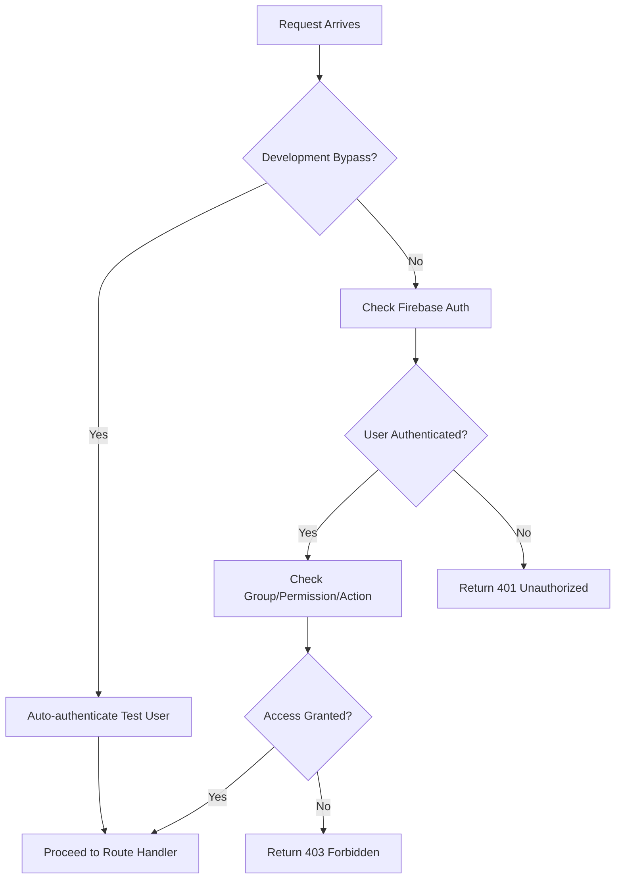
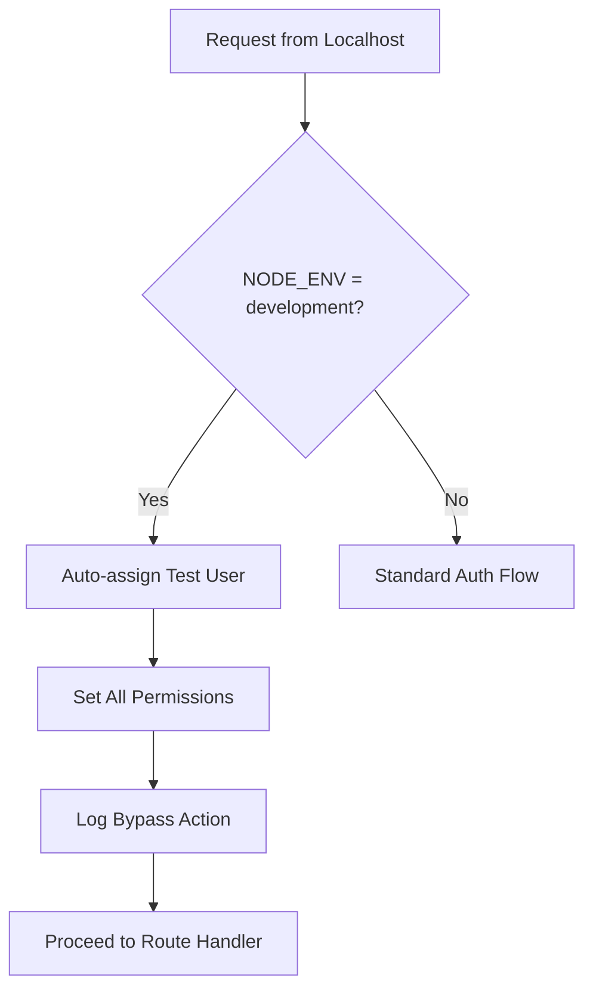

# Authentication & Middleware Documentation

**📅 Created:** October 25, 2025  
**🔧 Status:** ✅ PRODUCTION READY  
**📝 Last Updated:** October 25, 2025  

## 🔐 Overview

The Wavelength Lore application uses a sophisticated multi-layered authentication and authorization system built on Firebase Authentication with custom group-based permissions and development-friendly bypasses.

## 🏗️ Architecture

### Core Components
- **Firebase Authentication**: Primary user authentication
- **Group-Based Authorization**: Custom middleware for role-based access
- **Development Bypasses**: Localhost testing facilitation
- **Route Protection**: Per-route access control

### Middleware Stack
```javascript
// Typical protected route structure
app.get('/protected-route', 
  groupAuth.requireAction('specific_action'),
  (req, res) => { /* handler */ }
);
```

## 🛡️ GroupAuth Middleware (`middleware/groupAuth.js`)

### Primary Functions

#### 1. `requireGroup(groupName, options = {})`
**Purpose:** Require user to be member of specific group  
**Usage:** `groupAuth.requireGroup('admin')`

```javascript
// Example: Admin-only route
router.get('/admin/dashboard', 
  groupAuth.requireGroup('admin'), 
  (req, res) => {
    res.render('admin/dashboard');
  }
);
```

#### 2. `requirePermission(permission, options = {})`
**Purpose:** Require specific permission regardless of group  
**Usage:** `groupAuth.requirePermission('lore_edit')`

```javascript
// Example: Permission-based access
router.post('/api/lore/update', 
  groupAuth.requirePermission('lore_edit'), 
  (req, res) => {
    // Update lore content
  }
);
```

#### 3. `requireAction(action, options = {})`
**Purpose:** Require specific action capability  
**Usage:** `groupAuth.requireAction('game_access')`

```javascript
// Example: Game access control
router.get('/wavelength-gems', 
  groupAuth.requireAction('game_access'), 
  (req, res) => {
    res.render('games/wavelength-gems');
  }
);
```

### Configuration Options
All middleware functions accept an `options` object:

```javascript
{
  // Redirect unauthorized users instead of showing error
  redirectOnFailure: '/login',
  
  // Custom error message
  errorMessage: 'Access denied: Insufficient permissions',
  
  // Allow specific user IDs to bypass
  allowedUsers: ['user-id-1', 'user-id-2'],
  
  // Custom success callback
  onSuccess: (req, res, next) => { /* custom logic */ }
}
```

## 🚀 Development Bypasses

### Localhost Authentication Bypass

**File:** `middleware/groupAuth.js` lines 586-601

**Purpose:** Automatically authenticate localhost requests during development

**Conditions:**
```javascript
isDevelopmentBypass(req) {
  // Only enable in development environment
  const isDevelopment = !process.env.NODE_ENV || process.env.NODE_ENV === 'development';
  
  // Check if request is from localhost
  const isLocalhost = ['127.0.0.1', '::1', '::ffff:127.0.0.1'].includes(req.ip) || 
                     req.ip === 'localhost' ||
                     req.hostname === 'localhost';
  
  return isDevelopment && isLocalhost;
}
```

**Test User Provided:**
```javascript
getTestUser() {
  return {
    uid: 'test-user-localhost',
    email: 'test@localhost.dev',
    displayName: 'Test User (Localhost)',
    groups: ['admin', 'developer', 'tester'],
    permissions: ['all'],
    actions: ['all']
  };
}
```

**Logging Behavior:**
- ✅ **Logs bypass for non-API routes** to provide development visibility
- ✅ **Suppresses logs for API routes** to reduce console noise
- ✅ **Excludes image requests** from bypass logging

### Environment Variables

**Required for Production:**
```bash
NODE_ENV=production          # Disables development bypasses
FIREBASE_PROJECT_ID=your-id  # Firebase authentication
```

**Development Settings:**
```bash
NODE_ENV=development         # Enables localhost bypass (default)
# or leave NODE_ENV unset for development mode
```

## 🔄 Authentication Flow

### Standard Authentication Flow


### Development Bypass Flow


## 🎮 Route Examples

### Game Access Routes
```javascript
// Wavelength Gems Game
router.get('/wavelength-gems', 
  groupAuth.requireAction('game_access'), 
  (req, res) => {
    res.render('games/wavelength-gems', {
      title: 'Wavelength Gems',
      adMobEnvVars: { /* AdMob config */ }
    });
  }
);
```

### Admin Routes
```javascript
// Admin Dashboard
router.get('/admin/dashboard', 
  groupAuth.requireGroup('admin'), 
  (req, res) => {
    res.render('admin/dashboard');
  }
);

// Content Management
router.post('/admin/lore/create', 
  groupAuth.requirePermission('lore_create'),
  (req, res) => {
    // Create lore content
  }
);
```

### API Routes
```javascript
// User-specific API
router.get('/api/user/profile', 
  groupAuth.requireAction('profile_access'),
  (req, res) => {
    res.json({ profile: req.user });
  }
);
```

## 🧪 Testing Authentication

### Manual Testing Commands

**Test Development Bypass:**
```bash
# Should work (development + localhost)
curl http://localhost:3001/wavelength-gems

# Should show test user authentication in logs
```

**Test Production Authentication:**
```bash
# Set production environment
export NODE_ENV=production

# Restart server
node index.js

# Should require real authentication
curl http://localhost:3001/wavelength-gems
# Returns: 401 Unauthorized
```

### Automated Testing

**Using Test Runner:**
```bash
# Test authentication bypass
node scripts/unified/test-runner.js health http://localhost:3001

# Test protected routes
node scripts/unified/test-runner.js integration http://localhost:3001
```

**Custom Test Script:**
```javascript
// Test authentication middleware
const testAuth = async () => {
  // Test bypass in development
  process.env.NODE_ENV = 'development';
  const devResponse = await fetch('http://localhost:3001/wavelength-gems');
  console.log('Dev bypass:', devResponse.status === 200 ? '✅ Working' : '❌ Failed');
  
  // Test protection in production
  process.env.NODE_ENV = 'production';
  const prodResponse = await fetch('http://localhost:3001/wavelength-gems');
  console.log('Prod auth:', prodResponse.status === 401 ? '✅ Protected' : '❌ Bypass leak');
};
```

## 🔧 Configuration

### Firebase Authentication Setup
```javascript
// Firebase Admin SDK initialization
const admin = require('firebase-admin');
admin.initializeApp({
  credential: admin.credential.cert(serviceAccount),
  databaseURL: process.env.DATABASE_URL
});
```

### Group & Permission Configuration
**Location:** Firebase Realtime Database  
**Path:** `/forum/groups/` and `/forum/users/{uid}/groups`

**Example Group Structure:**
```json
{
  "groups": {
    "admin": {
      "name": "Administrators",
      "permissions": ["all"],
      "actions": ["all"],
      "members": ["user-id-1", "user-id-2"]
    },
    "developer": {
      "name": "Developers", 
      "permissions": ["lore_edit", "game_access"],
      "actions": ["game_access", "content_management"]
    }
  }
}
```

## 🚫 Security Considerations

### Development Bypass Security
- ✅ **Environment Gated**: Only active in development mode
- ✅ **IP Restricted**: Only localhost addresses allowed
- ✅ **Visible Logging**: All bypasses are logged for transparency
- ✅ **Test User Scoped**: Uses clearly identified test user

### Production Security
- 🔒 **No Bypasses**: All requests require valid Firebase authentication
- 🔒 **Group Validation**: Real-time group membership verification
- 🔒 **Permission Checks**: Granular permission enforcement
- 🔒 **Audit Logging**: Authentication attempts logged

### Best Practices
- ✅ **Always test in production mode** before deployment
- ✅ **Verify NODE_ENV=production** in production environments
- ✅ **Monitor authentication logs** for unusual patterns
- ✅ **Regular security audits** of group permissions

## 🔍 Debugging Authentication Issues

### Common Issues & Solutions

**Issue: Route returns 404 instead of 401**
```bash
# Check if route is properly registered
curl -I http://localhost:3001/your-route

# Verify middleware is applied
grep -r "your-route" routes/
```

**Issue: Development bypass not working**
```bash
# Check environment
echo $NODE_ENV

# Verify localhost detection
curl -v http://127.0.0.1:3001/your-route
```

**Issue: Production bypass still active**
```bash
# Verify production environment
NODE_ENV=production node -e "console.log(process.env.NODE_ENV)"

# Check server logs for bypass messages
tail -f server.log | grep "Development bypass"
```

### Debug Logging
Enable detailed authentication logging:
```javascript
// Add to middleware/groupAuth.js for debugging
console.log('Auth Debug:', {
  ip: req.ip,
  hostname: req.hostname, 
  nodeEnv: process.env.NODE_ENV,
  isDevelopment: !process.env.NODE_ENV || process.env.NODE_ENV === 'development',
  isLocalhost: isLocalhost,
  bypassActive: isDevelopment && isLocalhost
});
```

## 📋 Middleware Summary

### Active Middleware Files
- **`middleware/groupAuth.js`** - Primary authentication & authorization
- **`middleware/chatbot-auth.js`** - Chatbot-specific authentication  
- **`middleware/firebase-auth.js`** - Firebase authentication integration

### Route Protection Coverage
- **Games:** `requireAction('game_access')`
- **Admin:** `requireGroup('admin')`
- **Content Management:** `requirePermission('content_edit')`
- **API Endpoints:** Various based on functionality

### Development Tools
- **Automatic localhost bypass** for development efficiency
- **Test user provisioning** with full permissions
- **Comprehensive logging** for debugging
- **Environment-based configuration** for security

---

## 🎯 Quick Reference

### Common Middleware Patterns
```javascript
// Game access
groupAuth.requireAction('game_access')

// Admin only
groupAuth.requireGroup('admin')

// Content editing
groupAuth.requirePermission('content_edit')

// Custom options
groupAuth.requireAction('action', { 
  redirectOnFailure: '/login',
  errorMessage: 'Access denied'
})
```

### Testing Commands
```bash
# Health check with auth bypass
node scripts/unified/test-runner.js health http://localhost:3001

# Manual route test
curl http://localhost:3001/wavelength-gems

# Production auth test
NODE_ENV=production curl http://localhost:3001/wavelength-gems
```

This documentation provides comprehensive coverage of the authentication and middleware systems, including the development bypasses that facilitate testing and development workflow.